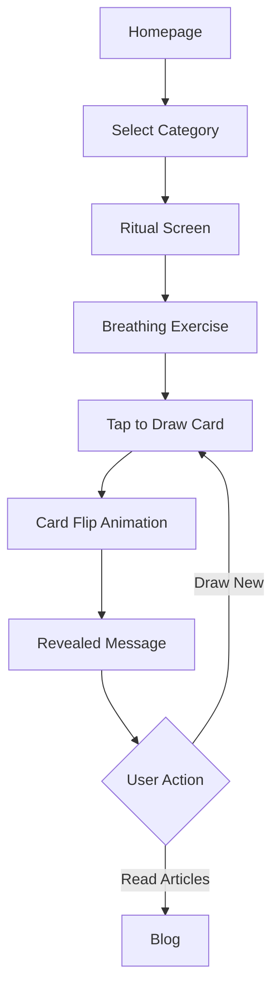
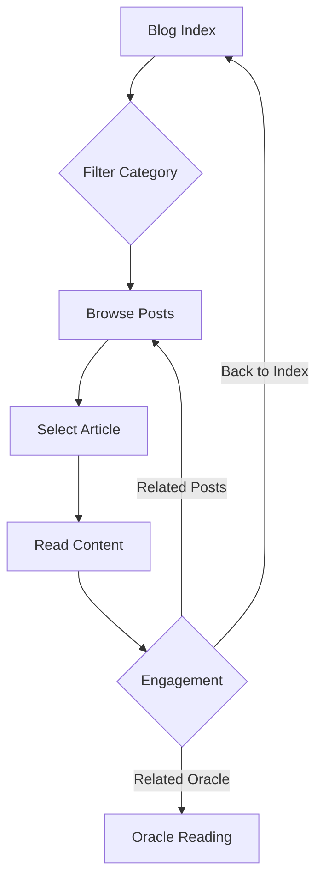

# 🌟 SOUL SPECTRUM (ที่พักใจ) - BRAND MASTER PLAN

> **Digital Sanctuary for Gen Z Mental Wellness**
> "วันนี้... ใจของเธอเป็นสีอะไร?"

---

## 📋 TABLE OF CONTENTS

1. [Brand Identity](#-brand-identity)
2. [Design System](#-design-system)
3. [Features & Content](#-features--content)
4. [Technical Architecture](#-technical-architecture)
5. [User Experience Flow](#-user-experience-flow)
6. [Content Strategy](#-content-strategy)

---

## 🎨 BRAND IDENTITY

### Brand Concept
- **Brand Name:** Soul Spectrum | โซลสเปกตรัม
- **Thai Name:** ที่พักใจ (Thipakjai - Heart's Haven)
- **Domain:** soul.thipakjai.com
- **Positioning:** Digital Sanctuary for Mental Wellness
- **Target Audience:** Gen Z & First Jobbers (18-28 years old)
- **Market Context:** Anxiety Economy - addressing burnout, relationship stress, career anxiety

### Brand Promise
"พื้นที่ปลอดภัยบนจอ ที่ใจของเธอจะได้พักผ่อน เข้าใจตัวเอง และค้นหาทิศทาง"

*A safe space on screen where your heart can rest, understand yourself, and find direction.*

### Brand Personality

| Dimension | Description |
|-----------|-------------|
| **Tone** | Gentle, caring, friend-like (not clinical) |
| **Voice** | Empowering without pressure, culturally Thai |
| **Emotion** | Warm, accepting, hopeful, patient |
| **Language** | Conversational Thai, Gen Z appropriate |

### Core Messages
- 💚 "คุณไม่ได้อยู่คนเดียว" (You're not alone)
- 🌙 "การพักผ่อนไม่ใช่ความขี้เกียจ" (Rest isn't laziness)
- ✨ "คุณมีค่าอยู่แล้ว" (You are already worthy)
- 🌱 "ค่อยๆ ดีขึ้น" (Slowly getting better)
- ⏳ "ให้เวลาตัวเอง" (Give yourself time)

---

## 🎨 DESIGN SYSTEM

### Color Palette

#### Primary Brand Colors
```css
/* Modern Indigo - Main Brand */
--primary: #6366F1
--primary-light: #818CF8
--primary-dark: #4F46E5

/* Vibrant Pink - Secondary */
--secondary: #EC4899
--secondary-light: #F472B6

/* Brand Teal - Accents */
--teal: #0D7377
--teal-deep: #134E4A
```

#### Background Colors
```css
/* Warm Cream Paper */
--bg-main: #FDFBF7
--bg-card: rgba(255, 255, 255, 0.95)
--bg-subtle: #F8FAFC
--bg-muted: #F1F5F9
```

#### Oracle Category Gradients
- **Health (สุขภาพ):** `#84FAB0` → `#8FD3F4` 🌿
- **Love (ความรัก):** `#FF9A9E` → `#FECFEF` 💕
- **Work (การงาน):** `#A1C4FD` → `#C2E9FB` 💼
- **Finance (การเงิน):** `#FFC3A0` → `#FFAFBD` ✨
- **Family (ครอบครัว):** `#D299C2` → `#FEF9D7` 🏠

### Typography

#### Font Families
```css
/* Body & UI - Modern Thai-friendly */
font-family: 'Prompt', sans-serif;
weights: 300, 400, 500, 600

/* Brand Logo - Premium Serif */
font-family: 'Playfair Display', serif;
weights: 400, 500, 600, 700
```

#### Typography Scale
| Level | Size | Weight | Usage |
|-------|------|--------|-------|
| Hero | 2.5rem (40px) | 300 | Main headlines |
| H1 | 2.5rem | 400 | Page titles |
| H2 | 1.875rem (30px) | 500 | Section headers |
| H3 | 1.25rem (20px) | 500 | Card titles |
| Body | 1rem (16px) | 400 | Content |
| Small | 0.875rem (14px) | 400 | Metadata |

### Visual Language

#### Design Principles
1. **Minimalism** - Clean, uncluttered, focused
2. **Gentleness** - Soft colors, rounded corners, subtle shadows
3. **Healing** - Breathing animations, calm movements
4. **Paper-like** - Texture, warmth, tangibility
5. **Magic** - Aura glows, holographic effects, subtle shimmer

#### Key Visual Elements
- 📄 **Noise Texture:** 3% opacity SVG for paper feel
- 🌈 **Radial Gradients:** Soft background glows
- 🎨 **Rotating Auras:** Watercolor images with radial masks
- ✨ **Holographic Backs:** Shifting gradient card backs
- 🌊 **Breathing Animations:** Gentle pulse effects
- 📐 **Rounded Corners:** 20px, 24px, 32px radius
- 💊 **Pill Shapes:** 9999px for buttons and pills

#### Animation Principles
```javascript
// Gentle Entry
duration: 0.8s
easing: [0.21, 0.47, 0.32, 0.98] // Custom ease-out

// Hover States
scale: 1.05
translateY: -8px
duration: 0.3s

// Continuous Movement
rotation: 360deg over 60-90s
breathing: opacity 0.1-0.3 over 3s
floating: -10px vertical over 4s
```

### Responsive Design

#### Breakpoints
```css
/* Mobile First */
base: 0-639px (mobile)
sm: 640px (large mobile)
md: 768px (tablet)
lg: 1024px (desktop)
```

#### Layout Strategy
- **Mobile:** 2-column grid for cards, single column content
- **Tablet:** Flexible wrapping, increased spacing
- **Desktop:** Multi-column grids, centered max-width containers

#### Container Sizes
- Reading: 720px max-width
- Blog Grid: 880px max-width
- Main Content: 1200px max-width

---

## 🎯 FEATURES & CONTENT

### Core Features

#### 1️⃣ Oracle Card Reading System
**Location:** `/oracle`

**Flow:**
```
Category Selection → Ritual/Meditation → Draw Card → Revealed Message
```

**Categories:**
- 🌿 **สุขภาพ (Health):** Body-mind wellness
- 💕 **ความรัก (Love):** Relationships and romance
- 💼 **การงาน (Work):** Career and professional life
- ✨ **ชีวิต (Finance):** Life and abundance
- 🏠 **ใจตัวเอง (Family):** Self and inner peace

**Features:**
- 3D card flip animation with perspective
- Holographic card backs with shimmer
- Breathing exercise/meditation prompt
- Randomized message selection
- Related blog article CTAs
- "Draw new card" functionality

**Data Structure:**
```json
{
  "id": "health_001",
  "category": "health",
  "gradient_theme": "green-to-blue",
  "message_title": "ฟังเสียงร่างกาย",
  "message_body": "ร่างกายของคุณกำลังส่งสัญญาณ...",
  "product_mapping": {
    "cta_text": "อ่านบทความ",
    "target_url": "/blog/burnout-recovery-guide"
  }
}
```

#### 2️⃣ Blog / Reading Room
**Location:** `/blog`

**Features:**
- Category filtering with pills
- 2-column responsive grid (1 on mobile)
- Scheduled post system (only shows published)
- Reading time estimation
- Related posts algorithm
- Cross-linking to oracle categories

**Blog Categories:**
| Category | Thai | Color | Focus |
|----------|------|-------|-------|
| Mental Health | สุขภาพจิต | Emerald | Anxiety, depression, burnout |
| Self Care | ดูแลตัวเอง | Pink | Routines, rest, boundaries |
| Relationships | ความสัมพันธ์ | Rose | Love, family, toxic patterns |
| Career | การทำงาน | Blue | Work-life, boundaries, growth |
| Life Advice | คำแนะนำชีวิต | Purple | Finance, decisions, mindset |
| Mindfulness | สติและสมาธิ | Teal | Meditation, presence, calm |

**Content Stats:**
- 30 scheduled posts (Jan 2026)
- 2-6 minute reading time
- Thai language, conversational tone
- Markdown formatting
- Rich metadata (tags, dates, related categories)

#### 3️⃣ Homepage
**Location:** `/`

**Design:**
- Full-screen centered layout
- Tagline: "วันนี้... ใจของเธอเป็นสีอะไร?"
- 4 vertical soul cards (tarot style)
- Rotating watercolor aura images
- Mobile: 2×2 grid (no scrolling)
- Desktop: Horizontal flex layout

**Cards:**
- ความรัก (Love)
- การงาน (Work)
- ชีวิต (Life)
- ใจตัวเอง (Self)

### Component Library

#### Navigation Components
- **Header:** Glassmorphism navigation bar with logo + nav pills
- **AppLayout:** Full-screen wrapper with optional footer

#### Interactive Components
- **OracleCard:** 3D flippable card with holographic back
- **CategoryButton:** Vertical card with rotating aura
- **BlogCard:** Paper-style card with teal accent
- **LinkButton:** UTM-tracked CTA with 3 variants (primary, secondary, ghost)

#### Utility Components
- **GoogleAnalytics:** GA4 integration with event tracking

---

## 🏗️ TECHNICAL ARCHITECTURE

### Tech Stack
```json
{
  "framework": "Next.js 16.1.0",
  "runtime": "React 19.2.3",
  "styling": "Tailwind CSS v4",
  "animation": "Framer Motion 12.23.26",
  "language": "TypeScript 5",
  "analytics": "Google Analytics 4 + GTM"
}
```

### Project Structure
```
src/
├── app/                    # Next.js App Router
│   ├── page.tsx           # Homepage
│   ├── oracle/page.tsx    # Oracle reading
│   ├── blog/
│   │   ├── page.tsx       # Blog index
│   │   └── [slug]/page.tsx # Blog post
│   ├── layout.tsx         # Root layout
│   ├── globals.css        # Global styles + Tailwind
│   └── sitemap.ts         # SEO
│
├── components/            # Reusable components
│   ├── Header.tsx
│   ├── AppLayout.tsx
│   ├── OracleCard.tsx
│   ├── CategoryButton.tsx
│   ├── BlogCard.tsx
│   ├── LinkButton.tsx
│   └── GoogleAnalytics.tsx
│
├── data/                  # Content data
│   ├── oracle_data.json   # Oracle messages
│   └── blog_posts.json    # Blog articles
│
├── types/                 # TypeScript types
│   ├── oracle.ts
│   └── blog.ts
│
├── hooks/                 # Custom React hooks
│   └── useOracle.ts       # Oracle state management
│
└── lib/                   # Utilities
    └── utils.ts           # Helper functions

public/
└── assets/
    └── auras/             # Watercolor aura images
        ├── Health.png
        ├── Love.png
        ├── Work.png
        ├── Finance.png
        └── Family.png
```

### Key Technologies

#### Styling Approach
- **Tailwind CSS v4** with `@import "tailwindcss"`
- Custom CSS variables in `globals.css`
- Utility-first with custom classes for complex effects
- Responsive design with mobile-first breakpoints

#### Animation System
- **Framer Motion** for all animations
- Entry animations with staggered delays
- Hover states with spring physics
- 3D transforms with `preserve-3d`
- Continuous animations (rotation, breathing, floating)

#### State Management
- React hooks (`useState`, `useEffect`)
- Custom `useOracle` hook for oracle flow
- URL parameters for category selection
- Local state only (no Redux/Zustand)

#### Analytics & Tracking
- Google Analytics 4 (GA4)
- Google Tag Manager (GTM)
- Custom event tracking for CTAs
- UTM parameter support

---

## 🔄 USER EXPERIENCE FLOW

### Oracle Reading Journey



**Key Moments:**
1. **Category Selection:** User chooses life area (15s)
2. **Ritual Preparation:** Breathing exercise, set intention (30s)
3. **Anticipation:** Card drawing moment (3s)
4. **Revelation:** Message revealed with animation (5s)
5. **Reflection:** Read and internalize message (60s+)
6. **Action:** Draw new card or explore blog

### Blog Reading Journey



**Content Discovery:**
- **Entry:** Via oracle CTA, navigation, or direct link
- **Filtering:** Category pills for focused browsing
- **Reading:** Clean, distraction-free layout
- **Cross-linking:** Related oracle categories and posts
- **Re-engagement:** Smooth navigation back to content

---

## 📝 CONTENT STRATEGY

### Content Pillars

#### 1. Mental Health Awareness
**Topics:**
- Burnout recovery and prevention
- Anxiety management techniques
- Depression understanding
- Stress coping strategies
- Professional help seeking

**Tone:** Informative, empathetic, destigmatizing

#### 2. Self-Care Practices
**Topics:**
- Morning/evening routines
- Boundary setting
- Rest and recovery
- Self-compassion
- Energy management

**Tone:** Practical, encouraging, non-judgmental

#### 3. Relationship Navigation
**Topics:**
- Toxic relationship signs
- Communication skills
- Family boundaries
- Friendship quality
- Self-love foundations

**Tone:** Supportive, validating, empowering

#### 4. Career & Life Balance
**Topics:**
- Work-life integration
- Saying no at work
- Career transitions
- Financial anxiety
- Time management

**Tone:** Realistic, solution-oriented, validating

#### 5. Mindfulness & Growth
**Topics:**
- Meditation for beginners
- Present moment awareness
- Emotional regulation
- Personal growth mindset
- Gratitude practices

**Tone:** Accessible, gentle, encouraging

### Content Guidelines

#### Writing Style
- ✅ Conversational Thai (ภาษาไทยพูด)
- ✅ Gen Z vocabulary and references
- ✅ Short paragraphs (3-4 lines max)
- ✅ Practical, actionable advice
- ✅ Emoji usage for warmth (not overuse)
- ✅ Personal examples and stories
- ❌ Clinical jargon
- ❌ Preachy or judgmental tone
- ❌ Toxic positivity

#### Content Structure
```markdown
# Clear, Engaging Title

**Hook paragraph** - Personal anecdote or relatable scenario

## Section 1: Understanding the Problem
- What is happening
- Why it matters
- Common experiences

## Section 2: Practical Solutions
- Step-by-step guidance
- Specific techniques
- Tools and resources

## Section 3: Moving Forward
- Gentle encouragement
- Realistic expectations
- When to seek help

**Closing** - Validating message, call to explore oracle
```

### Oracle Message Design

#### Message Categories
Each category has ~10 unique messages covering:

**Health:**
- Body signals, rest, energy, acceptance, recovery

**Love:**
- Self-love, boundaries, letting go, new beginnings, appreciation

**Work:**
- Career growth, burnout, validation, transitions, purpose

**Finance:**
- Abundance mindset, financial anxiety, worthiness, patience

**Family:**
- Boundaries, acceptance, roots, independence, healing

#### Message Structure
```
Title: Short, poetic phrase (3-5 words)
Body: 2-3 sentences with:
  - Validation of current state
  - Gentle insight or reframe
  - Actionable suggestion or encouragement
```

**Example:**
```
Title: "ฟังเสียงร่างกาย"
Body: "ร่างกายของคุณกำลังส่งสัญญาณมาให้ฟัง
อาจจะเป็นความเหนื่อยล้า หรือความต้องการพักผ่อน
ลองหยุดสักครู่ และถามตัวเองว่า 'ตอนนี้ร่างกายต้องการอะไร?'"
```

---

## 🎯 BRAND POSITIONING MAP

```
              Professional/Clinical
                      |
                      |
         Calm         |         Gentle
     (Headspace)      |      (Soul Spectrum) ⭐
                      |
    -------------------|-------------------
                      |
      Energetic       |       Playful
    (Fabulous)        |      (Co-Star)
                      |
                Personal/Mystical
```

**Soul Spectrum Position:**
- **Vertical Axis:** Personal & Accessible (not clinical)
- **Horizontal Axis:** Gentle & Caring (not playful)

**Competitive Differentiation:**
- ✅ Thai language and cultural context
- ✅ Gen Z-specific mental health focus
- ✅ Oracle + Blog integrated ecosystem
- ✅ Gentle, non-gamified experience
- ✅ Free, accessible, no paywall

---

## 📊 SUCCESS METRICS (Future)

### Engagement Metrics
- **Oracle Usage:** Cards drawn per session, category distribution
- **Blog Performance:** Page views, reading time, bounce rate
- **User Flow:** Homepage → Oracle → Blog conversion
- **Retention:** Repeat visits, weekly active users

### Content Metrics
- **Popular Categories:** Most drawn oracle categories
- **Top Posts:** Most-read blog articles
- **Related Content:** Oracle → Blog cross-link clicks
- **Sharing:** Social shares, referrals

### Brand Health
- **Sentiment:** User feedback, testimonials
- **Reach:** Organic traffic, social media mentions
- **Trust:** Time on site, pages per session
- **Community:** User-generated content, word-of-mouth

---

## 🚀 FUTURE ROADMAP (Considerations)

### Phase 2: Enhanced Features
- [ ] User accounts for saving favorite cards/posts
- [ ] Daily oracle card push notifications
- [ ] Journaling feature for reflection
- [ ] Community forum or comment system
- [ ] Audio-guided meditations

### Phase 3: Content Expansion
- [ ] Video content (breathing exercises, meditation)
- [ ] Podcast integration
- [ ] Expert collaborations (therapists, coaches)
- [ ] User story features
- [ ] Weekly newsletter

### Phase 4: Personalization
- [ ] AI-powered card recommendations
- [ ] Mood tracking over time
- [ ] Personalized content feeds
- [ ] Progress milestones
- [ ] Custom oracle decks

---

## 📌 BRAND ESSENTIALS CHECKLIST

### Visual Identity
- ✅ Logo: "Soul Spectrum" in Playfair Display
- ✅ Color Palette: Warm cream + vibrant gradients
- ✅ Typography: Prompt (Thai-friendly) + Playfair
- ✅ Aura Imagery: 5 watercolor category images
- ✅ Iconography: Category emojis (🌿💕💼✨🏠)

### Content Assets
- ✅ Oracle Messages: 50+ unique cards across 5 categories
- ✅ Blog Posts: 30 scheduled articles
- ✅ Brand Messaging: Taglines, core messages, tone guidelines

### Technical Assets
- ✅ Website: Fully functional Next.js app
- ✅ Analytics: GA4 + GTM integration
- ✅ SEO: Sitemap, robots.txt, meta tags
- ✅ Responsive: Mobile, tablet, desktop optimized

### Brand Guidelines
- ✅ Voice & Tone: Gentle, caring, friend-like
- ✅ Language: Thai Gen Z conversational
- ✅ Visual Style: Paper-like minimalism with magic
- ✅ Animation: Gentle, breathing, non-intrusive

---

## 💫 CLOSING STATEMENT

**Soul Spectrum (ที่พักใจ)** is a thoughtfully designed digital sanctuary that addresses the mental wellness needs of Thai Gen Z and young professionals. Through the integration of psychological oracle readings and evidence-based blog content, the platform creates a safe, gentle, and accessible space for self-reflection, healing, and growth.

**Core Strengths:**
1. **Cultural Relevance:** Thai language, Gen Z context, local mental health landscape
2. **Design Excellence:** Paper-like aesthetic, gentle animations, healing visual language
3. **Content Quality:** Empathetic messaging, actionable advice, non-judgmental tone
4. **User Experience:** Intuitive flows, cross-linked ecosystem, mobile-optimized
5. **Technical Execution:** Modern stack, performant, analytics-ready

**Brand Promise Delivered:**
"พื้นที่ที่ใจของคุณปลอดภัย พักผ่อนได้ และค้นพบทิศทางของตัวเอง"

---

**Document Version:** 1.0
**Last Updated:** December 2025
**Maintained By:** Soul Spectrum Team

---

*Made with ❤️ for everyone who needs a moment to breathe.*
