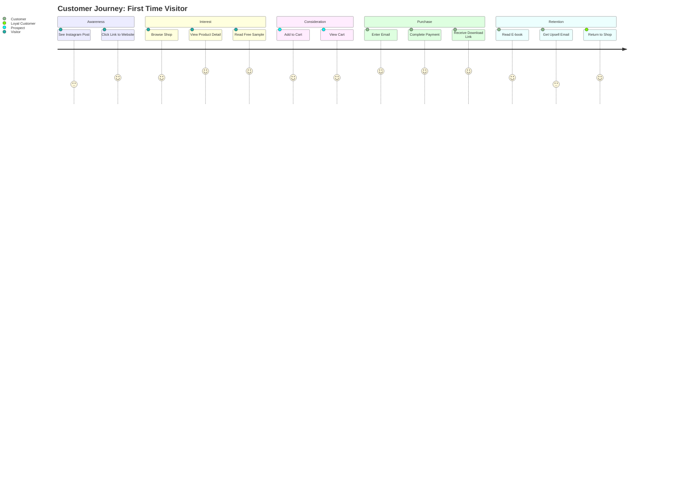

# 03: Website & Technical - คู่มือเว็บไซต์และระบบเทคนิค

> **สรุป (Thai Summary):**  
> ไฟล์นี้คือ "แผนที่เทคนิค" ของระบบที่พักใจ รวมทั้ง Dual-System Architecture, Database Schema, Tech Stack, User Flow และ Emotional Funnel

---

## 📖 Story Summary: สถาปัตยกรรมของบ้านที่พักใจ

### ทำไมต้องมี 2 เว็บไซต์?

ลองนึกภาพว่าถ้าคุณเปิดร้านขายหนังสือเยียวยาใจ คุณจะเลือกสร้างร้านแบบไหน? ร้านที่มีแค่ชั้นวางหนังสือกับเคาน์เตอร์คิดเงิน? หรือร้านที่มีมุมนั่งอ่าน มีกาแฟให้จิบ มีบรรยากาศอบอุ่นที่ทำให้คนอยากใช้เวลา?

ที่พักใจเลือกแบบที่สอง และนี่คือเหตุผลที่เราออกแบบ **Dual-System Architecture** — สถาปัตยกรรม 2 ระบบที่ทำหน้าที่ต่างกันแต่เชื่อมโยงกัน

**ระบบแรก: Mothership (thipakjai.com)** คือ "ร้านค้าหลัก" ที่เน้นการซื้อขาย มีแค็ตตาล็อกสินค้า, ตะกร้าสินค้า, ระบบชำระเงิน, และคลังดาวน์โหลดสำหรับลูกค้า น้ำเสียงของเว็บนี้คือ "ร้านค้า + บ้าน" — ยินดีต้อนรับแต่พร้อมทำธุรกิจ

**ระบบสอง: The Feeling Library (library.thipakjai.com)** คือ "ห้องสมุด" ที่เน้นการให้คุณค่า เป็นที่ที่คนเจ็บปวดสามารถมาพักใจโดยไม่ต้องซื้ออะไร มีบทความฟรี, แบบทดสอบ Inner Signal Decoder, และ Digital Sanctuary Kit เป็นของแถม น้ำเสียงของเว็บนี้คือ "ห้องสมุด + ที่พัก" — สงบ ปลอดภัย ไม่มีแรงกดดัน

การแยก 2 ระบบนี้ทำให้เราสามารถ "ให้ก่อน" ได้อย่างเต็มที่โดยไม่ทำให้รู้สึกว่ากำลังขายของ คนที่มาห้องสมุดไม่รู้สึกถูกกดดัน แต่เมื่อพร้อม พวกเขาสามารถเดินไปยังร้านค้าหลักได้อย่างเป็นธรรมชาติ

### The Feeling Library: ประตูสู่การเยียวยา

The Feeling Library ไม่ใช่แค่เว็บไซต์ แต่เป็น "ประสบการณ์การเยียวยา" ที่ออกแบบมาอย่างดี

เมื่อคนเข้ามา พวกเขาจะพบกับ **The Hug** (การโอบกอด) — หน้า Landing Page ที่บอกว่า "มาพักที่นี่ก่อนนะ" ไม่มีการขายของ ไม่มีโฆษณา มีแค่คำถามเดียว: "ใจเธอกำลังต้องการอะไร?"

จากนั้นพวกเขาจะได้ทำ **Inner Signal Decoder Quiz** — แบบทดสอบ 7 ข้อที่ช่วยให้รู้จักตัวเองว่าเป็น Archetype ไหน เป็น Silent Carrier (คนแบกผู้เงียบงัน)? Future Worrier (นักกังวลอนาคต)? หรือ Burnout Soul (หมดไฟทั้งกายใจ)?

เมื่อรู้ผล พวกเขาจะได้รับ 2 สิ่ง: **ความเข้าใจตัวเอง** ผ่านคำอธิบายที่ทำให้รู้สึก "ถูกมองเห็น" และ **Hero Product Recommendation** ที่แนะนำสินค้าที่เหมาะกับปัญหาของพวกเขา แต่ยังไม่ขาย แค่แนะนำ

สุดท้าย ทุกคนจะได้รับ **Digital Sanctuary Kit** ฟรี ประกอบด้วย 3 Healing Wallpapers, Personalized Cheat Sheet, และ Relaxation Audio 5 นาที โดยมีข้อแลกเปลี่ยนเดียว: กรอก Email เพื่อรับ Kit

นี่คือจุดเริ่มต้นของความสัมพันธ์ เมื่อได้ Email แล้ว ระบบ CRM จะเริ่มส่งจดหมายดูแลอย่างต่อเนื่อง ค่อยๆ สร้างความไว้ใจ จนวันหนึ่งพวกเขาพร้อมจะซื้อสินค้า

### Tech Stack: เครื่องมือที่เลือกมาอย่างตั้งใจ

ที่พักใจเลือกใช้ Tech Stack ที่เน้นความเร็ว, ความปลอดภัย, และความยืดหยุ่น ทั้งหมดนี้ต้องรันได้ด้วยทีมเล็กๆ หรือแม้แต่คนเดียว

**Frontend** เลือกใช้ **Next.js 14+** เพราะรองรับ SEO ได้ดี มี Server-Side Rendering และ App Router ที่ทันสมัย ใช้ **Tailwind CSS** หรือ **Vanilla CSS** สำหรับ Styling และ **Framer Motion** สำหรับ Animation ที่ลื่นไหล

**Backend & Database** เลือกใช้ **Supabase (PostgreSQL)** เพราะมี Free Tier ที่เอื้อเฟื้อ มี Realtime และ Auth ในตัว ไม่ต้องตั้ง Server เอง ไฟล์ดิจิทัลทั้งหมดเก็บใน **Supabase Storage** ที่ปลอดภัยและเร็ว

**E-commerce** ใช้ **Stripe** สำหรับการรับชำระเงิน เป็นมาตรฐานโลกที่เชื่อถือได้ ตะกร้าสินค้าจัดการด้วย **Zustand** หรือ **Context API** บน Client-side

**Marketing & Automation** ใช้ **Resend** หรือ **Nodemailer** สำหรับส่ง Email และ **LINE Messaging API** สำหรับเชื่อมต่อกับ LINE OA ซึ่งเป็นสิ่งจำเป็นในตลาดไทย

**Hosting** เลือก **Vercel** เพราะเป็น Best-in-class สำหรับ Next.js และ **Cloudflare** สำหรับ DNS และ Security

### Database Schema: โครงสร้างข้อมูลหัวใจของระบบ

ฐานข้อมูลของที่พักใจออกแบบมาเพื่อรองรับทั้ง E-commerce และ CRM ในที่เดียวกัน

**Products Table** เก็บข้อมูลสินค้าทั้งหมด ไม่ใช่แค่ชื่อกับราคา แต่รวมถึง "mood" (เช่น burnout, anxiety, self-love) และ "target_audience" (เช่น silent_carrier, future_worrier) เพื่อให้ระบบแนะนำสินค้าได้อย่างชาญฉลาด

**Customers Table** เก็บข้อมูลลูกค้าพร้อม "archetype" ที่ได้จาก Quiz ทำให้เราสามารถ Personalize ทุก Email และทุกการแนะนำได้

**Orders & Order Items** จัดการคำสั่งซื้อและสินค้าในแต่ละคำสั่งซื้อ มี "download_token" สำหรับสร้างลิงก์ดาวน์โหลดที่ปลอดภัย

**Quiz Responses** เก็บคำตอบทุกข้อจาก Quiz เพื่อวิเคราะห์และปรับปรุง Quiz ในอนาคต

**Email Sequences** ติดตามว่าลูกค้าแต่ละคนอยู่ที่ขั้นตอนไหนของ Email Automation ช่วยให้ไม่ส่ง Email ซ้ำหรือผิดจังหวะ

### Emotional Funnel: การเดินทางทางอารมณ์

สิ่งที่ทำให้เว็บไซต์ที่พักใจต่างจากเว็บ E-commerce ทั่วไปคือ เราไม่ได้คิดแค่ Sales Funnel แต่คิดถึง **Emotional Funnel** — การเดินทางทางอารมณ์ของลูกค้า

**Stage 1: Awareness (การรู้จัก)** — "เออ มีแบรนด์นี้ด้วยนะ" ช่องทางหลักคือ TikTok, Instagram, Pinterest เนื้อหาเป็น Carousel และ Short Videos

**Stage 2: Interest (ความสนใจ)** — "น่าสนใจนะ ลองดูหน่อย" ช่องทางหลักคือ Website, Blog, Quiz เน้นบทความฟรีและ Free Sample

**Stage 3: Desire (ความต้องการ)** — "เราอยากได้อันนี้" ช่องทางหลักคือ Email, LINE OA, Product Pages เน้น Testimonials และ Product Benefits

**Stage 4: Action (การซื้อ)** — "ซื้อเลย!" ช่องทางคือ Checkout และ Payment เน้น UX ที่ลื่นไหลและ Trust Signals

**Stage 5: Retention (การกลับมา)** — "ชอบมาก อยากซื้อเพิ่ม!" ช่องทางคือ Email, LINE OA, Community เน้น Upsells และ New Releases

### Constant Companion: เพื่อนที่อยู่เคียงข้าง

ทุกหน้าใน Feeling Library มี **Sticky Footer** ที่ติดด้านล่างเสมอ แสดงข้อความ "ถ้าพร้อมเมื่อไหร่ เรารออยู่นะ 💚" พร้อมปุ่ม 2 ปุ่ม: "Chat กับฟ้าใส" (ไปยัง LINE OA) และ "Shop ที่พักใจ" (ไปยังร้านค้าหลัก)

นี่คือ "Constant Companion" — การเตือนอย่างนุ่มนวลว่าเมื่อพร้อม เรามีสินค้าให้ แต่ไม่เร่งรัด ไม่กดดัน

### บทสรุป

เอกสาร Website & Technical นี้คือ "พิมพ์เขียว" ของระบบดิจิทัลทั้งหมด ตั้งแต่สถาปัตยกรรม 2 ระบบ, Tech Stack, Database Schema, ไปจนถึง Emotional Funnel ใช้เป็นเอกสารอ้างอิงเมื่อต้องพัฒนาเว็บไซต์ ปรับปรุงระบบ หรือเข้าใจว่าทุกอย่างเชื่อมโยงกันอย่างไร สิ่งสำคัญที่สุดคือ เทคโนโลยีทั้งหมดนี้มีเป้าหมายเดียว: **ทำให้คนรู้สึกปลอดภัยและพร้อมที่จะเยียวยาตัวเอง**

---

## Table of Contents
1. [Dual-System Architecture](#1-dual-system-architecture)
2. [Sitemap & User Flow](#2-sitemap--user-flow)
3. [Tech Stack](#3-tech-stack)
4. [Database Schema](#4-database-schema)
5. [Emotional Funnel](#5-emotional-funnel)
6. [The Feeling Library](#6-the-feeling-library)

---

## 1. Dual-System Architecture

### 1.1 The Two Vessels

```
┌───────────────────────────────────────────────────────────────────┐
│                    THE HEART'S HAVEN ECOSYSTEM                    │
├───────────────────────────────┬───────────────────────────────────┤
│     🏠 MOTHERSHIP              │     📚 SATELLITE                  │
│     thipakjai.com              │     library.thipakjai.com         │
│                               │                                    │
│     Purpose: E-COMMERCE       │     Purpose: LEAD GENERATION       │
│     - Product Listings        │     - Free Articles               │
│     - Shopping Cart           │     - Quiz (Lead Magnet)          │
│     - Checkout                │     - Landing Pages               │
│     - Customer Accounts       │     - Email Capture               │
│                               │                                    │
│     Tone: "ร้านค้า + บ้าน"      │     Tone: "ห้องสมุด + ที่พัก"        │
└───────────────────────────────┴───────────────────────────────────┘
```

### 1.2 Mothership: thipakjai.com

**Primary Functions:**
- Product Showcase & Catalog
- Shopping Cart & Checkout
- Customer Account Management
- Order History & Digital Downloads
- Blog (SEO Content)

**Key Pages:**

| Page | URL | Purpose |
|------|-----|---------|
| Home | `/` | Brand Story + Featured Products |
| Shop | `/shop` | All Products Catalog |
| Product Detail | `/product/{slug}` | Individual Product Page |
| Cart | `/cart` | Shopping Cart |
| Checkout | `/checkout` | Payment Flow |
| Account | `/account` | Customer Dashboard |
| Downloads | `/account/downloads` | Digital Library |
| Blog | `/blog` | SEO Content |
| About | `/about` | Brand Story |
| Contact | `/contact` | Support & FAQ |

### 1.3 Satellite: The Feeling Library

**Primary Functions:**
- Emotional Intake (Quiz)
- Free Content Hub
- Lead Magnet Delivery
- Soft Selling through Content

**Detailed Structure:** See [Section 6: The Feeling Library](#6-the-feeling-library)

---

## 2. Sitemap & User Flow

### 2.1 Complete Sitemap

```
thipakjai.com/
├── 🏠 Home (/)
│   ├── Hero Section (Value Prop)
│   ├── Featured Products
│   ├── Testimonials
│   └── CTA → Quiz or Shop
│
├── 🛒 Shop (/shop)
│   ├── All Products
│   ├── Filter by Category
│   │   ├── E-books
│   │   ├── Planners
│   │   ├── Audio
│   │   ├── Wallpapers
│   │   └── Bundles
│   └── Sort (Price, Popular, New)
│
├── 📖 Product (/product/{slug})
│   ├── Product Images
│   ├── Title & Description
│   ├── Price & Add to Cart
│   ├── Value Stack (What's Included)
│   ├── Sample Preview
│   └── Related Products
│
├── 🛍️ Cart (/cart)
│   ├── Cart Items
│   ├── Promo Code Input
│   ├── Order Summary
│   └── Proceed to Checkout
│
├── 💳 Checkout (/checkout)
│   ├── Email Input
│   ├── Payment Method
│   └── Order Confirmation
│
├── 👤 Account (/account)
│   ├── Dashboard
│   ├── Order History
│   ├── Downloads (Digital Library)
│   └── Settings
│
├── 📝 Blog (/blog)
│   ├── Article List
│   └── Article Detail (/blog/{slug})
│
├── ℹ️ About (/about)
├── 📞 Contact (/contact)
├── 🔒 Privacy (/privacy)
└── 📋 Terms (/terms)
```

### 2.2 User Journey: Discovery to Purchase



### 2.3 User Flow: Checkout Process

```
┌─────────────┐     ┌─────────────┐     ┌─────────────┐
│  Product    │ --> │    Cart     │ --> │  Checkout   │
│   Page      │     │   Page      │     │   Page      │
│             │     │             │     │             │
│ [Add to Cart]     │ [Checkout]        │ [Pay Now]
└─────────────┘     └─────────────┘     └─────────────┘
                                              │
                    ┌────────────────────────┘
                    ▼
            ┌───────────────┐
            │   Stripe      │
            │   Payment     │
            │   Processing  │
            └───────┬───────┘
                    │
        ┌──────────┴──────────┐
        ▼                     ▼
┌───────────────┐     ┌───────────────┐
│   Success     │     │   Failed      │
│   Page        │     │   Page        │
│               │     │               │
│ Download Link │     │ Retry Payment │
└───────────────┘     └───────────────┘
```

---

## 3. Tech Stack

### 3.1 Frontend

| Component | Technology | Why |
|-----------|-----------|-----|
| Framework | **Next.js 14+** | SEO, SSR, App Router |
| Styling | **Tailwind CSS** or **Vanilla CSS** | Rapid UI Development |
| UI Components | **shadcn/ui** | Accessible, Customizable |
| Animations | **Framer Motion** | Smooth Micro-interactions |
| Icons | **Lucide Icons** | Consistent, Clean |

### 3.2 Backend & Database

| Component | Technology | Why |
|-----------|-----------|-----|
| Database | **Supabase (PostgreSQL)** | Free Tier, Realtime, Auth |
| Auth | **Supabase Auth** | Email/Social Login |
| Storage | **Supabase Storage** | Digital File Storage |
| API | **Next.js API Routes** | Serverless Functions |

### 3.3 E-commerce & Payments

| Component | Technology | Why |
|-----------|-----------|-----|
| Cart | **Zustand** or **Context API** | Client-side State |
| Payments | **Stripe** | Global, Reliable |
| Digital Delivery | **Custom + Supabase** | Secure Download Links |
| Coupons | **Custom System** | Flexible Discount Logic |

### 3.4 Marketing & Automation

| Component | Technology | Why |
|-----------|-----------|-----|
| Email | **Resend** or **Nodemailer** | Transactional + Marketing |
| Analytics | **Google Analytics 4** | Traffic & Conversion |
| Heatmaps | **Hotjar** (Optional) | UX Insights |
| LINE OA | **LINE Messaging API** | Thai Market Essential |

### 3.5 Hosting & Deployment

| Component | Technology | Why |
|-----------|-----------|-----|
| Hosting | **Vercel** | Best for Next.js |
| Domain | **Cloudflare** | DNS, Security |
| CDN | **Vercel Edge** | Fast Asset Delivery |
| Monitoring | **Vercel Analytics** | Performance Tracking |

---

## 4. Database Schema

### 4.1 Core Tables (Supabase/PostgreSQL)

```sql
-- Products Table
CREATE TABLE products (
  id UUID PRIMARY KEY DEFAULT gen_random_uuid(),
  name TEXT NOT NULL,
  slug TEXT UNIQUE NOT NULL,
  description TEXT,
  short_hook TEXT, -- คำโปรยสั้น
  price DECIMAL(10,2) NOT NULL,
  compare_at_price DECIMAL(10,2), -- ราคาปกติ (ก่อนลด)
  category TEXT, -- 'ebook', 'planner', 'audio', 'wallpaper', 'bundle'
  mood TEXT, -- 'burnout', 'anxiety', 'self-love', etc.
  target_audience TEXT, -- 'silent_carrier', 'future_worrier', 'burnout_soul'
  images JSONB, -- Array of image URLs
  files JSONB, -- Array of download file URLs
  features TEXT[], -- Key features for listing
  is_active BOOLEAN DEFAULT true,
  is_featured BOOLEAN DEFAULT false,
  created_at TIMESTAMPTZ DEFAULT NOW(),
  updated_at TIMESTAMPTZ DEFAULT NOW()
);

-- Customers Table
CREATE TABLE customers (
  id UUID PRIMARY KEY DEFAULT gen_random_uuid(),
  email TEXT UNIQUE NOT NULL,
  name TEXT,
  archetype TEXT, -- Quiz result: 'silent_carrier', 'future_worrier', 'burnout_soul'
  quiz_completed_at TIMESTAMPTZ,
  line_user_id TEXT, -- LINE OA connection
  created_at TIMESTAMPTZ DEFAULT NOW()
);

-- Orders Table
CREATE TABLE orders (
  id UUID PRIMARY KEY DEFAULT gen_random_uuid(),
  customer_id UUID REFERENCES customers(id),
  email TEXT NOT NULL,
  stripe_payment_intent_id TEXT,
  status TEXT DEFAULT 'pending', -- 'pending', 'paid', 'delivered', 'refunded'
  subtotal DECIMAL(10,2),
  discount DECIMAL(10,2) DEFAULT 0,
  total DECIMAL(10,2),
  coupon_code TEXT,
  download_token TEXT UNIQUE, -- Secure download link token
  download_expires_at TIMESTAMPTZ,
  created_at TIMESTAMPTZ DEFAULT NOW()
);

-- Order Items Table
CREATE TABLE order_items (
  id UUID PRIMARY KEY DEFAULT gen_random_uuid(),
  order_id UUID REFERENCES orders(id),
  product_id UUID REFERENCES products(id),
  product_name TEXT,
  price DECIMAL(10,2),
  quantity INTEGER DEFAULT 1
);

-- Coupons Table
CREATE TABLE coupons (
  id UUID PRIMARY KEY DEFAULT gen_random_uuid(),
  code TEXT UNIQUE NOT NULL,
  discount_type TEXT NOT NULL, -- 'percentage', 'fixed'
  discount_value DECIMAL(10,2) NOT NULL,
  minimum_order DECIMAL(10,2) DEFAULT 0,
  max_uses INTEGER,
  current_uses INTEGER DEFAULT 0,
  valid_from TIMESTAMPTZ,
  valid_until TIMESTAMPTZ,
  is_active BOOLEAN DEFAULT true,
  created_at TIMESTAMPTZ DEFAULT NOW()
);

-- Reviews Table
CREATE TABLE reviews (
  id UUID PRIMARY KEY DEFAULT gen_random_uuid(),
  product_id UUID REFERENCES products(id),
  customer_id UUID REFERENCES customers(id),
  rating INTEGER CHECK (rating >= 1 AND rating <= 5),
  comment TEXT,
  is_approved BOOLEAN DEFAULT false,
  created_at TIMESTAMPTZ DEFAULT NOW()
);

-- Quiz Responses Table
CREATE TABLE quiz_responses (
  id UUID PRIMARY KEY DEFAULT gen_random_uuid(),
  customer_id UUID REFERENCES customers(id),
  email TEXT NOT NULL,
  responses JSONB, -- {question_1: 'a', question_2: 'c', ...}
  archetype TEXT, -- Result archetype
  score_breakdown JSONB, -- {silent_carrier: 5, future_worrier: 3, burnout_soul: 2}
  completed_at TIMESTAMPTZ DEFAULT NOW()
);

-- Email Sequences Table
CREATE TABLE email_sequences (
  id UUID PRIMARY KEY DEFAULT gen_random_uuid(),
  customer_id UUID REFERENCES customers(id),
  sequence_name TEXT, -- 'welcome', 'post_purchase', 'abandoned_cart'
  current_step INTEGER DEFAULT 1,
  last_sent_at TIMESTAMPTZ,
  completed BOOLEAN DEFAULT false,
  paused BOOLEAN DEFAULT false
);
```

### 4.2 Row Level Security (RLS)

```sql
-- Enable RLS
ALTER TABLE customers ENABLE ROW LEVEL SECURITY;
ALTER TABLE orders ENABLE ROW LEVEL SECURITY;

-- Customers can only see their own data
CREATE POLICY "Users can view own data" ON customers
  FOR SELECT USING (auth.uid() = id);

-- Orders are viewable by the order owner
CREATE POLICY "Users can view own orders" ON orders
  FOR SELECT USING (customer_id = auth.uid());
```

### 4.3 Database Functions

```sql
-- Function to get download links
CREATE OR REPLACE FUNCTION get_download_links(order_token TEXT)
RETURNS TABLE (
  product_name TEXT,
  files JSONB
) AS $$
BEGIN
  RETURN QUERY
  SELECT 
    oi.product_name,
    p.files
  FROM orders o
  JOIN order_items oi ON o.id = oi.order_id
  JOIN products p ON oi.product_id = p.id
  WHERE o.download_token = order_token
    AND o.status = 'paid'
    AND (o.download_expires_at IS NULL OR o.download_expires_at > NOW());
END;
$$ LANGUAGE plpgsql;
```

---

## 5. Emotional Funnel

### 5.1 The 5-Stage Funnel

```
    ┌─────────────────────────────────────────────┐
    │         1. AWARENESS (การรู้จัก)             │
    │                                             │
    │  "เออ มีแบรนด์นี้ด้วยนะ..."                   │
    │                                             │
    │  Channels: TikTok, Instagram, Pinterest     │
    │  Content: Carousel, Short Videos            │
    │  Goal: Reach & Impressions                  │
    └───────────────────────┬─────────────────────┘
                            ▼
    ┌─────────────────────────────────────────────┐
    │         2. INTEREST (ความสนใจ)              │
    │                                             │
    │  "น่าสนใจนะ ลองดูหน่อย..."                    │
    │                                             │
    │  Channels: Website, Blog, Quiz              │
    │  Content: Articles, Free Samples            │
    │  Goal: Website Visit & Email Capture        │
    └───────────────────────┬─────────────────────┘
                            ▼
    ┌─────────────────────────────────────────────┐
    │         3. DESIRE (ความต้องการ)             │
    │                                             │
    │  "เราอยากได้อันนี้..."                        │
    │                                             │
    │  Channels: Email, LINE OA, Product Pages    │
    │  Content: Product Benefits, Testimonials    │
    │  Goal: Add to Cart                          │
    └───────────────────────┬─────────────────────┘
                            ▼
    ┌─────────────────────────────────────────────┐
    │         4. ACTION (การซื้อ)                 │
    │                                             │
    │  "ซื้อเลย!"                                  │
    │                                             │
    │  Channels: Checkout, Payment                │
    │  Content: Smooth UX, Trust Signals          │
    │  Goal: Completed Purchase                   │
    └───────────────────────┬─────────────────────┘
                            ▼
    ┌─────────────────────────────────────────────┐
    │         5. RETENTION (การกลับมา)            │
    │                                             │
    │  "ชอบมาก อยากซื้อเพิ่ม!"                      │
    │                                             │
    │  Channels: Email, LINE OA, Community        │
    │  Content: Upsells, New Releases             │
    │  Goal: Repeat Purchase & Referral           │
    └─────────────────────────────────────────────┘
```

### 5.2 Conversion Goals by Stage

| Stage | Metric | Target |
|-------|--------|--------|
| Awareness | Impressions | 50,000/month |
| Interest | Website Visits | 5,000/month |
| Interest | Email Signups | 500/month (10% of visits) |
| Desire | Add to Cart | 250/month (5% of visits) |
| Action | Purchases | 100/month (2% of visits) |
| Retention | Repeat Customers | 20% of buyers |

---

## 6. The Feeling Library

### 6.1 Concept Overview

**The Feeling Library (ห้องสมุดความรู้สึก):**
- เว็บไซต์ Satellite ที่เป็นเหมือน "ห้องสมุด" สำหรับคนที่กำลังเจ็บปวด
- ไม่เน้นขายของ แต่เน้นให้คุณค่าก่อน
- เป็น Lead Generation Hub หลัก

### 6.2 Page Structure

```
library.thipakjai.com/
│
├── 🏠 The Hug (/)
│   └── Landing Page: Quiz Intake
│       "มาดูกันว่าใจเธอกำลังต้องการอะไร"
│
├── 📋 The Quiz (/quiz)
│   └── Inner Signal Decoder
│       7 คำถามเพื่อหาว่าคุณเป็น Archetype ไหน
│
├── 🎁 The Result (/result/{archetype})
│   └── Quiz Results + Recommendation
│       "เธอคือ... The Silent Carrier"
│       + Hero Product Recommendation
│       + Free Digital Sanctuary Kit
│
├── 📚 The Reading Room (/articles)
│   └── Free Articles by Category
│       ├── Burnout
│       ├── Relationships
│       ├── Self-Love
│       └── Financial Anxiety
│
└── 🎨 The Gallery (/gallery)
    └── Free Wallpaper Samples
```

### 6.3 Healing Funnel (User Flow)

```
Step 1: THE HUG (ต้อนรับ)
        ↓
        "สวัสดีนะ... มาพักตรงนี้ก่อนสิ"
        ↓
        [เริ่มทำแบบทดสอบ]
        
Step 2: THE CHAT (ถามไถ่)
        ↓
        7 คำถาม Inner Signal Decoder
        ↓
        
Step 3: THE ROOT CAUSE (ค้นหาต้นตอ)
        ↓
        ประมวลผล → หา Archetype
        ↓
        
Step 4: THE SMALL STEP (ขั้นแรก)
        ↓
        แสดงผลลัพธ์ + Hero Product Match
        "เธอคือ The Silent Carrier"
        "เราแนะนำหนังสือเล่มนี้สำหรับเธอ..."
        ↓
        
Step 5: THE SOUVENIR (ของที่ระลึก)
        ↓
        Digital Sanctuary Kit (Free Download)
        + Email Capture
        ↓
        → Enter Email Marketing Sequence
        → Soft CTA to Shop
```

### 6.4 Quiz Data Structure

```json
{
  "quiz_id": "inner-signal-decoder",
  "questions": [
    {
      "id": 1,
      "question": "ช่วงนี้เวลาตื่นนอน คุณรู้สึกยังไง?",
      "options": [
        {"value": "a", "text": "เหนื่อยก่อนจะเริ่มวัน", "scores": {"burnout_soul": 2, "silent_carrier": 1}},
        {"value": "b", "text": "กังวลเรื่องที่ต้องทำ", "scores": {"future_worrier": 2}},
        {"value": "c", "text": "รู้สึกว่าต้องรับผิดชอบเยอะ", "scores": {"silent_carrier": 2}}
      ]
    }
    // ... more questions
  ],
  "results": {
    "silent_carrier": {
      "title": "The Silent Carrier",
      "description": "คุณคือคนที่แบกโลกไว้บนบ่า...",
      "hero_product": "ล้มได้ ไม่ต้องรีบลุก",
      "hero_product_slug": "gentle-pause-ebook"
    },
    "future_worrier": {
      "title": "The Future Worrier",
      "description": "สมองคุณไม่เคยหยุดคิด...",
      "hero_product": "Financial Healing Planner",
      "hero_product_slug": "financial-healing-planner"
    },
    "burnout_soul": {
      "title": "The Burnout Soul",
      "description": "พลังงานคุณกำลังจะหมด...",
      "hero_product": "Healing Audio Series",
      "hero_product_slug": "healing-audio-series"
    }
  }
}
```

### 6.5 Constant Companion (Sticky UI)

**Sticky Footer CTA:**
- ติดท้ายทุกหน้าใน Feeling Library
- แสดง 2 ปุ่ม:
  1. **"Chat กับฟ้าใส"** → LINE OA
  2. **"Shop ที่พักใจ"** → Main Website

```html
<!-- Sticky Footer Example -->
<div class="fixed bottom-0 left-0 right-0 bg-teal-900 text-cream p-4">
  <div class="flex justify-between items-center max-w-screen-md mx-auto">
    <span>"ถ้าพร้อมเมื่อไหร่ เรารออยู่นะ 💚"</span>
    <div class="flex gap-2">
      <a href="https://line.me/@thipakjai" class="btn btn-outline">
        Chat กับฟ้าใส
      </a>
      <a href="https://thipakjai.com/shop" class="btn btn-primary">
        Shop ที่พักใจ
      </a>
    </div>
  </div>
</div>
```

---

> **Document Version:** 1.0  
> **Last Updated:** December 2024  
> **Source Files:** File 1 (Master Business Plan), File 4 (Website Architecture), File 10 (Satellite Business Strategy - Feeling Library Section)
