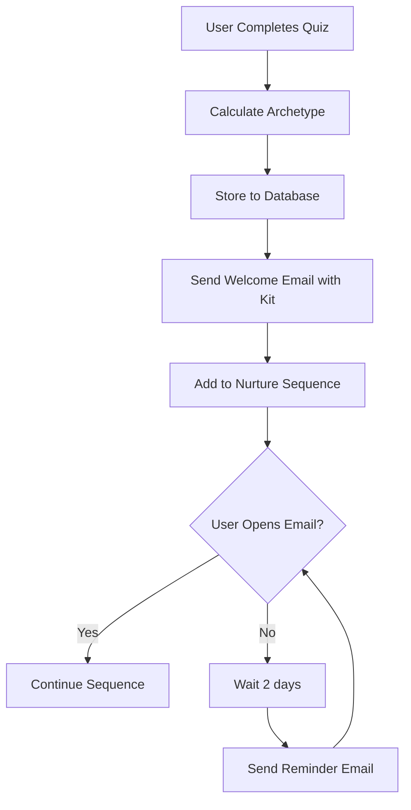
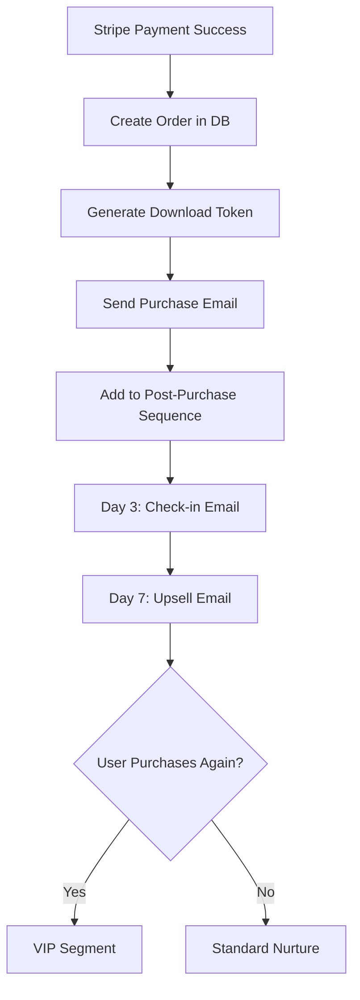
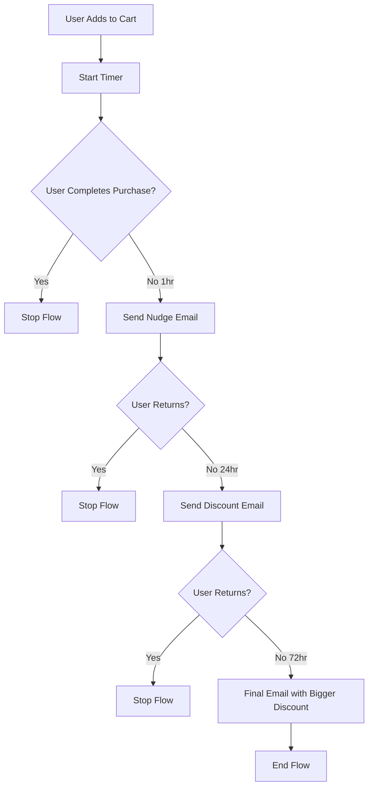

# 05: Lead Generation & CRM - ระบบดักจับลูกค้าและ Automation

> **สรุป (Thai Summary):**  
> ไฟล์นี้คือ "ระบบประสาน" ระหว่างลูกค้ากับแบรนด์ รวมทั้ง Quiz System, CRM Philosophy, Email Sequences, LINE OA Scripts และ Technical Variables

---

## 📖 Story Summary: ศิลปะแห่งการดูแลใจ

### ปรัชญา: เราไม่ใช่นักขาย เราเป็นเพื่อนทางจดหมาย

CRM ของที่พักใจไม่เหมือน CRM ทั่วไปที่เน้น "Push" ข้อความขายของตลอดเวลา เราเรียกปรัชญาการสื่อสารของเราว่า **"The Pen Pal Protocol"** — เราเป็นเพื่อนทางจดหมาย ไม่ใช่แบรนด์ที่ส่งโปรโมชั่น

ทุก Email ต้องรู้สึกเหมือนจดหมายส่วนตัวจากเพื่อนที่ห่วงใย ไม่ใช่ Marketing Blast ที่ส่งให้หมื่นคนพร้อมกัน เราเน้นการสร้างความสัมพันธ์ระยะยาว ไม่ใช่การขายครั้งเดียวแล้วหายไป และที่สำคัญที่สุด: **ให้คุณค่าก่อนเสมอ ขายทีหลัง**

### Inner Signal Decoder Quiz: ประตูสู่การเข้าใจตัวเอง

หัวใจของระบบ Lead Generation คือ **Inner Signal Decoder Quiz** — แบบทดสอบ 7 ข้อที่ใช้เวลาเพียง 2-3 นาที

ปรัชญาของ Quiz คือ "เราไม่วินิจฉัย เราเพียงแค่ Validate" นั่นหมายความว่า Quiz ไม่ใช่การตัดสิน แต่เป็นการช่วยให้ผู้ทำรู้จักตัวเองมากขึ้น ทุกผลลัพธ์ต้องให้ความรู้สึก "ถูกมองเห็น" และ "ถูกเข้าใจ" ไม่มีผลลัพธ์ที่ "แย่" หรือ "ดี" มีแค่ "ต่าง"

**คำถามแต่ละข้อถูกออกแบบมาอย่างตั้งใจ** เช่น คำถามที่ 1: "ช่วงนี้เวลาตื่นนอน คุณรู้สึกยังไง?" ถ้าตอบว่า "เหนื่อยก่อนจะเริ่มวัน ไม่อยากลุกเลย" ระบบจะให้คะแนน Burnout Soul 2 คะแนน และ Silent Carrier 1 คะแนน ถ้าตอบว่า "กังวลเรื่องที่ต้องทำวันนี้" ระบบจะให้คะแนน Future Worrier 2 คะแนน

เมื่อทำ Quiz ครบ ระบบจะนับคะแนนและหา Archetype ที่มีคะแนนสูงสุด

### 3 Archetypes: 3 ตัวตนที่ต้องการความช่วยเหลือต่างกัน

**The Silent Carrier (เดอะแบกผู้เงียบงัน)** คือคนที่แบกโลกทั้งใบไว้บนบ่า ภายนอกดูเก่ง จัดการได้ทุกอย่าง แต่ภายในแบกความเหนื่อยล้าไว้คนเดียว กลัว "สายตาคนอื่น" มากกว่ากลัวล้มเหลว สิ่งที่ต้องการคือพื้นที่ที่ไม่ต้องแกล้งทำเป็นเข้มแข็ง และการยอมรับว่าเหนื่อยได้โดยไม่ถูกตัดสิน สินค้าที่แนะนำคือ "ล้มได้ ไม่ต้องรีบลุก"

**The Future Worrier (นักกังวลอนาคต)** คือคนที่สมองไม่เคยหยุดคิด คิดไปล่วงหน้า วางแผนทุกอย่าง แต่ก็กังวลว่าจะทำได้ไหม บ่อยครั้งนอนไม่หลับเพราะความคิดไม่หยุด สิ่งที่ต้องการคือเครื่องมือช่วยจัดระเบียบความคิด และวิธีอยู่กับปัจจุบัน สินค้าที่แนะนำคือ "Financial Healing Planner"

**The Burnout Soul (หมดไฟทั้งกายใจ)** คือคนที่พลังงานกำลังจะหมด รู้สึกเหมือนหุ่นยนต์ที่ทำงานไปวันๆ ไม่มีความสุขกับสิ่งที่เคยชอบ บางวันแค่ตื่นมาก็เหนื่อยแล้ว สิ่งที่ต้องการคือการพักผ่อนที่แท้จริง และบรรยากาศที่ช่วยฟื้นฟูพลังงาน สินค้าที่แนะนำคือ "Healing Audio Series"

### Digital Sanctuary Kit: ของขวัญแรกจากเพื่อน

หลังทำ Quiz เสร็จ ทุกคนจะได้รับ **Digital Sanctuary Kit** ฟรี ประกอบด้วย 3 Healing Wallpapers (ภาพพื้นหลังบำบัด), Personalized Cheat Sheet (เทคนิคเฉพาะสำหรับ Archetype ของคุณ), และ 1 Audio Track 5 นาที (เสียงผ่อนคลาย)

ข้อแลกเปลี่ยนเดียวคือการกรอก Email และนี่คือจุดเริ่มต้นของความสัมพันธ์ระยะยาว

### Email Sequences: จดหมายจากเพื่อน

ระบบอีเมลของที่พักใจแบ่งเป็น 3 Sequence หลัก:

**Welcome Sequence (หลังทำ Quiz)** เริ่มด้วย Welcome Letter ที่ส่งทันที ("ยินดีต้อนรับกลับบ้านนะ [ชื่อ]") พร้อมลิงก์ดาวน์โหลด Kit วันที่ 3 จะส่ง Value Email ให้ 3 Micro-Actions ที่เหมาะกับ Archetype วันที่ 7 จะส่ง Soft Sell แนะนำสินค้าที่เหมาะ พร้อมโค้ดส่วนลด 15% สำหรับการซื้อครั้งแรก (FIRSTHUG)

**Post-Purchase Sequence (หลังซื้อ)** เริ่มด้วย Order Confirmation ที่อบอุ่น ("ขอบคุณที่เลือกมาพักใจกับเรา") พร้อมลิงก์ดาวน์โหลด วันที่ 3 จะส่ง Check-in Email ถามว่าอ่านไปถึงไหนแล้ว แนะนำบทที่เหมาะกับ Archetype วันที่ 7 จะส่ง Upsell Email แนะนำสินค้าเสริม พร้อมโค้ดลด 20% สำหรับลูกค้าเก่า (HEALMORE)

**Abandoned Cart Sequence (ทิ้งตะกร้า)** 1 ชั่วโมงหลังทิ้ง จะส่ง Gentle Nudge ไม่มีแรงกดดัน ("ถ้าพร้อมเมื่อไหร่ สินค้ารอเธออยู่") 24 ชั่วโมงหลังทิ้ง จะส่ง Incentive Email พร้อมโค้ดลด 10% เป็นเวลา 48 ชั่วโมง (COMEBACK10)

### LINE OA Scripts: บทพูดสำหรับเพื่อนที่ใกล้ชิดที่สุด

LINE OA คือ "The Best Friend" — ช่องทางที่ใกล้ชิดที่สุดกับลูกค้า

**Auto-Reply Scripts** รวมถึง Welcome Message สำหรับคนที่เพิ่ง Add ("สวัสดีนะ 🏠 ยินดีต้อนรับสู่ที่พักใจ พื้นที่ปลอดภัยสำหรับคนที่ต้องการพักหายใจ"), Order Inquiry สำหรับคนถามเรื่องคำสั่งซื้อ, และ Download Issue สำหรับคนที่โหลดไฟล์ไม่ได้

**Broadcast Templates** รวมถึง Weekly Healing Message ทุกวันจันทร์ ("สัปดาห์ใหม่แล้ว... ไม่ต้องสู้หนักทุกวันก็ได้นะ แค่รอดมาก็เก่งแล้ว") และ Product Feature ทุกวันพฤหัสบดี

### Customer Journey: จากเมล็ดพันธุ์สู่ต้นไม้ใหญ่

เราแบ่งลูกค้าเป็น 4 ระยะ:

**🌱 SEED (เมล็ดพันธุ์)** — ทำ Quiz → รับ Kit → เข้าสู่ Welcome Sequence

**🌿 SPROUT (ต้นกล้า)** — อ่าน Email → เข้าเว็บ → Browse สินค้า

**🌻 BLOOM (ดอกบาน)** — ซื้อสินค้าครั้งแรก → เข้าสู่ Post-Purchase Sequence

**🌳 TREE (ต้นไม้ใหญ่)** — ซื้อซ้ำ → แนะนำเพื่อน → เป็น Brand Advocate

### Automation Workflows: ระบบอัตโนมัติที่ดูแลแทนเรา

เอกสารนี้รวม Flowchart สำหรับ 3 Workflows หลัก:

**Quiz Completion Flow** — เมื่อทำ Quiz เสร็จ → คำนวณ Archetype → เก็บลง Database → ส่ง Welcome Email พร้อม Kit → เพิ่มเข้า Nurture Sequence → ถ้าไม่เปิด Email ภายใน 2 วัน ส่ง Reminder

**Purchase Flow** — เมื่อ Stripe Payment Success → สร้าง Order ใน Database → สร้าง Download Token → ส่ง Purchase Email → วันที่ 3 ส่ง Check-in → วันที่ 7 ส่ง Upsell → ถ้าซื้อซ้ำ ย้ายไป VIP Segment

**Abandoned Cart Flow** — เมื่อ Add to Cart → เริ่ม Timer → ถ้าไม่ซื้อ 1 ชม. ส่ง Nudge → ถ้าไม่กลับ 24 ชม. ส่ง Discount → ถ้าไม่กลับ 72 ชม. ส่ง Final Email พร้อมส่วนลดใหญ่

### Technical Variables: ตัวแปรสำหรับ Personalization

เอกสารนี้รวมตัวแปรทั้งหมดที่ใช้ใน Email เช่น [NAME] (ชื่อจริง), [ARCHETYPE] (ผล Quiz), [HERO_PRODUCT_NAME] (สินค้าที่แนะนำ), [DOWNLOAD_LINK] (ลิงก์ดาวน์โหลดเฉพาะ), และ Conditional Content Blocks สำหรับแสดงเนื้อหาต่างกันตาม Archetype

### บทสรุป

เอกสาร Lead Generation & CRM นี้คือ "หัวใจ" ของการดูแลลูกค้า ตั้งแต่ Quiz System ที่ช่วยให้คนรู้จักตัวเอง, Email Sequences ที่ดูแลอย่างต่อเนื่อง, LINE OA Scripts ที่เป็นเพื่อนใกล้ชิด, ไปจนถึง Automation Workflows ที่ทำงานแทนเราตลอด 24 ชั่วโมง สิ่งที่ต้องจำไว้เสมอคือ: **เราเป็นเพื่อนทางจดหมาย ไม่ใช่นักขาย**

---

## Table of Contents
1. [Quiz System: Inner Signal Decoder](#1-quiz-system-inner-signal-decoder)
2. [CRM Philosophy](#2-crm-philosophy)
3. [Email Sequences](#3-email-sequences)
4. [LINE OA Scripts](#4-line-oa-scripts)
5. [Technical Variables](#5-technical-variables)
6. [Automation Workflows](#6-automation-workflows)

---

## 1. Quiz System: Inner Signal Decoder

### 1.1 Quiz Philosophy

> **"เราไม่วินิจฉัย เราเพียงแค่ Validate"**

**หลักการ:**
- Quiz ไม่ใช่การตัดสิน แต่เป็นการช่วยให้ผู้ทำรู้จักตัวเองมากขึ้น
- ทุกผลลัพธ์ต้องให้ความรู้สึก "ถูกมองเห็น" และ "ถูกเข้าใจ"
- ไม่มีผลลัพธ์ที่ "แย่" หรือ "ดี" มีแค่ "ต่าง"

### 1.2 Quiz Mechanics

**จำนวนคำถาม:** 7 ข้อ  
**เวลาที่ใช้:** 2-3 นาที  
**วิธีการนับคะแนน:** Frequency Counting (นับจำนวนครั้งที่เลือกแต่ละ Archetype)

**Scoring Logic:**
```javascript
// Example scoring logic
const scores = {
  silent_carrier: 0,
  future_worrier: 0,
  burnout_soul: 0
};

// Each answer adds to relevant archetype scores
answers.forEach(answer => {
  Object.keys(answer.scores).forEach(archetype => {
    scores[archetype] += answer.scores[archetype];
  });
});

// Determine result: highest score wins
const result = Object.keys(scores).reduce((a, b) => 
  scores[a] > scores[b] ? a : b
);
```

### 1.3 Quiz Questions

**Question 1: ช่วงนี้เวลาตื่นนอน คุณรู้สึกยังไง?**

| Option | Text | Scores |
|--------|------|--------|
| A | เหนื่อยก่อนจะเริ่มวัน ไม่อยากลุกเลย | burnout_soul: 2, silent_carrier: 1 |
| B | กังวลเรื่องที่ต้องทำวันนี้ | future_worrier: 2 |
| C | รู้สึกว่าต้องรับผิดชอบอะไรเยอะมาก | silent_carrier: 2 |

**Question 2: เวลามีปัญหา คุณมักจะ...?**

| Option | Text | Scores |
|--------|------|--------|
| A | เก็บไว้คนเดียว ไม่อยากเป็นภาระใคร | silent_carrier: 2 |
| B | คิดไปล่วงหน้าว่าจะเกิดอะไรขึ้นต่อ | future_worrier: 2 |
| C | รู้สึกหมดแรงจะจัดการ | burnout_soul: 2 |

**Question 3: ถ้าให้เลือกกิจกรรมพักผ่อน คุณอยากทำอะไร?**

| Option | Text | Scores |
|--------|------|--------|
| A | นอนอยู่บ้านเฉยๆ ไม่อยากไปไหน | burnout_soul: 2 |
| B | หาอะไรมาทำให้หัวไม่ว่าง | future_worrier: 2 |
| C | ใช้เวลาคนเดียว ไม่ต้องพูดกับใคร | silent_carrier: 2 |

**Question 4: คุณรู้สึกยังไงเกี่ยวกับอนาคต?**

| Option | Text | Scores |
|--------|------|--------|
| A | กังวล คิดเรื่องเงิน/งานบ่อยมาก | future_worrier: 2 |
| B | ไม่ค่อยคิด แค่รอดไปวันๆ ก็พอ | burnout_soul: 2, silent_carrier: 1 |
| C | วางแผนไว้หมด แต่กลัวจะทำไม่ได้ | future_worrier: 1, silent_carrier: 2 |

**Question 5: คนรอบข้างมักจะพูดว่าคุณเป็นคนยังไง?**

| Option | Text | Scores |
|--------|------|--------|
| A | เก่ง จัดการได้ทุกอย่าง | silent_carrier: 2 |
| B | คิดมาก กังวลไปก่อน | future_worrier: 2 |
| C | เหนื่อยง่าย ต้องพักบ่อย | burnout_soul: 2 |

**Question 6: เวลาทำอะไรผิดพลาด คุณรู้สึกยังไง?**

| Option | Text | Scores |
|--------|------|--------|
| A | โทษตัวเองหนักมาก | silent_carrier: 2, future_worrier: 1 |
| B | กลัวว่าจะมีผลกระทบต่อไปอีก | future_worrier: 2 |
| C | ไม่ค่อยรู้สึกอะไร ชาไปหมด | burnout_soul: 2 |

**Question 7: ถ้าให้เลือก 1 ประโยคที่อยากได้ยินตอนนี้มากที่สุด?**

| Option | Text | Scores |
|--------|------|--------|
| A | "พักได้นะ ไม่ต้องแบกคนเดียว" | silent_carrier: 2 |
| B | "ไม่ต้องกังวล ทุกอย่างจะโอเค" | future_worrier: 2 |
| C | "เหนื่อยก็ได้ ไม่มีใครเร่ง" | burnout_soul: 2 |

### 1.4 Quiz Results

**Result: The Silent Carrier 🟣**

```
┌────────────────────────────────────────────────────────┐
│           🟣 THE SILENT CARRIER                         │
│              เดอะแบกผู้เงียบงัน                          │
├────────────────────────────────────────────────────────┤
│                                                        │
│   เธอคือคนที่แบกโลกทั้งใบไว้บนบ่า...                     │
│   แม้ภายนอกจะดูเก่ง จัดการได้ทุกอย่าง                    │
│   แต่ภายในกลับแบกความเหนื่อยล้าไว้คนเดียว               │
│                                                        │
│   เธอกลัว "สายตาคนอื่น" มากกว่ากลัวล้มเหลว              │
│   และมักจะให้คนอื่นก่อนตัวเองเสมอ                       │
│                                                        │
│   💚 สิ่งที่เธอต้องการตอนนี้:                            │
│   - พื้นที่ที่ไม่ต้องแกล้งทำเป็นเข้มแข็ง                    │
│   - การยอมรับว่าเหนื่อยได้ โดยไม่ถูกตัดสิน                │
│                                                        │
│   📚 เราแนะนำ: "ล้มได้ ไม่ต้องรีบลุก"                    │
│   หนังสือที่เขียนมาเพื่อคนเหนื่อยอย่างเธอโดยเฉพาะ        │
│                                                        │
└────────────────────────────────────────────────────────┘
```

**Result: The Future Worrier 🟢**

```
┌────────────────────────────────────────────────────────┐
│           🟢 THE FUTURE WORRIER                         │
│              นักกังวลอนาคต                              │
├────────────────────────────────────────────────────────┤
│                                                        │
│   สมองเธอไม่เคยหยุดคิด...                               │
│   คิดไปล่วงหน้า วางแผนทุกอย่าง                          │
│   แต่ก็กังวลว่าจะทำได้ไหม หรือมีอะไรพลาดไปรึเปล่า        │
│                                                        │
│   เธอควบคุมสิ่งรอบข้างมากเกินไป                         │
│   และบ่อยครั้งนอนไม่หลับเพราะความคิดไม่หยุด              │
│                                                        │
│   💚 สิ่งที่เธอต้องการตอนนี้:                            │
│   - เครื่องมือช่วยจัดระเบียบความคิด                      │
│   - วิธีอยู่กับปัจจุบัน ไม่ใช่อนาคต                        │
│                                                        │
│   📚 เราแนะนำ: "Financial Healing Planner"             │
│   วางแผนชีวิตแบบไม่เครียด ไม่กดดัน                      │
│                                                        │
└────────────────────────────────────────────────────────┘
```

**Result: The Burnout Soul 🟠**

```
┌────────────────────────────────────────────────────────┐
│           🟠 THE BURNOUT SOUL                           │
│              หมดไฟทั้งกายใจ                             │
├────────────────────────────────────────────────────────┤
│                                                        │
│   พลังงานของเธอกำลังจะหมด...                            │
│   รู้สึกเหมือนเป็นหุ่นยนต์ที่ทำงานไปวันๆ                  │
│   ไม่มีความสุขกับสิ่งที่เคยชอบอีกต่อไป                   │
│                                                        │
│   บางวันแค่ตื่นมาก็เหนื่อยแล้ว                           │
│   และไม่รู้จะเติมพลังยังไง                               │
│                                                        │
│   💚 สิ่งที่เธอต้องการตอนนี้:                            │
│   - การพักผ่อนที่แท้จริง ไม่ใช่การหนี                    │
│   - บรรยากาศที่ช่วยฟื้นฟูพลังงาน                         │
│                                                        │
│   📚 เราแนะนำ: "Healing Audio Series"                  │
│   เสียงบำบัดที่ช่วยให้พักจริงๆ                           │
│                                                        │
└────────────────────────────────────────────────────────┘
```

### 1.5 Digital Sanctuary Kit (Free Reward)

**หลังทำ Quiz เสร็จ ทุกคนได้รับ:**

| Item | Format | Description |
|------|--------|-------------|
| 🖼️ 3 Healing Wallpapers | PNG | ภาพพื้นหลังบำบัด |
| 📄 Personalized Cheat Sheet | PDF | เทคนิคสำหรับ Archetype ของคุณ |
| 🎵 1 Audio Track (5 min) | MP3 | Relaxation audio sample |

**ข้อแลกเปลี่ยน:** กรอก Email เพื่อรับ Kit

---

## 2. CRM Philosophy

### 2.1 The Pen Pal Protocol

> **"เราไม่ใช่แบรนด์ที่ส่งโปรโมชั่น เราเป็นเพื่อนทางจดหมาย"**

**หลักการ:**
- ทุก Email ต้องรู้สึกเหมือนจดหมายส่วนตัว ไม่ใช่ Marketing Blast
- เน้นการสร้างความสัมพันธ์ระยะยาว ไม่ใช่การขายครั้งเดียว
- ให้คุณค่าก่อนเสมอ ขายทีหลัง

### 2.2 Customer Journey Stages

```
┌──────────────────────────────────────────────────────────────┐
│                    CUSTOMER JOURNEY MAP                       │
├──────────────────────────────────────────────────────────────┤
│                                                              │
│   🌱 SEED (เมล็ดพันธุ์)                                       │
│   └── ทำ Quiz → รับ Kit → เข้าสู่ Welcome Sequence            │
│                                                              │
│   🌿 SPROUT (ต้นกล้า)                                         │
│   └── อ่าน Email → เข้าเว็บ → Browse สินค้า                   │
│                                                              │
│   🌻 BLOOM (ดอกบาน)                                          │
│   └── ซื้อสินค้าครั้งแรก → เข้าสู่ Post-Purchase Sequence      │
│                                                              │
│   🌳 TREE (ต้นไม้ใหญ่)                                        │
│   └── ซื้อซ้ำ → แนะนำเพื่อน → เป็น Brand Advocate             │
│                                                              │
└──────────────────────────────────────────────────────────────┘
```

### 2.3 Communication Timing Rules

| Touchpoint | Timing | Purpose |
|------------|--------|---------|
| Welcome Email | ทันทีหลัง Quiz | ส่ง Kit + แนะนำตัว |
| Nurture Email 1 | Day 3 | ให้ Value + Soft CTA |
| Nurture Email 2 | Day 7 | Insight + Product Mention |
| Promotional Email | Day 14 | First Promo Offer |
| Win-Back Email | Day 30 | "คิดถึงนะ" + Special Offer |

---

## 3. Email Sequences

### 3.1 Welcome Sequence (Post-Quiz)

**Email 1: Welcome Letter (ส่งทันที)**

```
Subject: 🏠 ยินดีต้อนรับกลับบ้านนะ, [NAME]

---

สวัสดีนะ [NAME],

ขอบคุณที่พาตัวเองมาพักที่นี่... 

เราเข้าใจนะว่าการยอมรับว่า "ใจเหนื่อย" ไม่ใช่เรื่องง่าย
แต่การที่เธอกล้าหยุดและมองดูใจตัวเอง...
มันคือก้าวแรกที่กล้าหาญมากแล้ว 💚

---

📊 ผลลัพธ์ของเธอ: [ARCHETYPE_NAME]

[ARCHETYPE_DESCRIPTION - 2-3 lines]

---

🎁 ของขวัญเล็กๆ จากเรา

เราเตรียม Digital Sanctuary Kit มาให้เธอ
- 3 Healing Wallpapers
- [ARCHETYPE] Cheat Sheet
- Relaxation Audio (5 min)

👇 กดดาวน์โหลดได้เลย
[DOWNLOAD BUTTON]

---

ค่อยๆ พักใจนะ  
ไม่ต้องรีบไปไหน เราอยู่ตรงนี้ 🫶

ด้วยรัก,
ฟ้าใส
ที่พักใจ

P.S. ถ้าอยากอ่านเพิ่มเกี่ยวกับ [ARCHETYPE] 
ลองดูบทความนี้นะ → [ARTICLE_LINK]
```

**Email 2: Value Email (Day 3)**

```
Subject: 💡 3 สิ่งที่ [ARCHETYPE] ควรลองทำสัปดาห์นี้

---

สวัสดีอีกครั้งนะ [NAME],

วันนี้เราอยากแบ่งปันเทคนิคเล็กๆ
ที่เหมาะกับคนอย่างเธอโดยเฉพาะ...

---

🌱 3 Micro-Actions สำหรับ [ARCHETYPE]

1. [ARCHETYPE-SPECIFIC TIP 1]
   (ทำได้ใน 2 นาที)

2. [ARCHETYPE-SPECIFIC TIP 2]
   (ลองก่อนนอน)

3. [ARCHETYPE-SPECIFIC TIP 3]
   (ทำซ้ำทุกวัน)

---

ไม่ต้องทำทั้งหมดนะ
แค่เลือกอันที่รู้สึกว่าทำได้ก็พอ
ค่อยๆ ไป ไม่มีใครเร่ง 💚

ฟ้าใส
```

**Email 3: Soft Sell (Day 7)**

```
Subject: 📚 หนังสือที่เราเขียนมาเพื่อเธอ

---

สวัสดีนะ [NAME],

วันก่อนเราคุยกันเรื่อง [ARCHETYPE TIP] ไป
วันนี้อยากแนะนำอะไรให้เพิ่มอีกหน่อย...

---

เราเพิ่งเขียนหนังสือเล่มหนึ่ง
ชื่อว่า "[HERO_PRODUCT_NAME]"

เป็นหนังสือที่เราเขียนมาสำหรับคนที่...
[PAIN POINT ที่ตรงกับ ARCHETYPE]

---

📖 สิ่งที่เธอจะได้จากหนังสือเล่มนี้:

✅ [BENEFIT 1]
✅ [BENEFIT 2]
✅ [BENEFIT 3]

+ ของแถม: Workbook + 5 Wallpapers

---

ถ้าพร้อมเมื่อไหร่ แวะมาดูได้นะ
[PRODUCT_LINK]

และถ้ายังไม่พร้อม ก็ไม่เป็นไร
เราจะยังคงอยู่ตรงนี้เสมอ 💚

ฟ้าใส

P.S. ตอนนี้มีโค้ด FIRSTHUG ลด 15% 
สำหรับการซื้อครั้งแรกนะ
```

### 3.2 Post-Purchase Sequence

**Email 1: Order Confirmation (ทันที)**

```
Subject: 🎉 ขอบคุณนะ! นี่คือลิงก์ดาวน์โหลดของเธอ

---

ยินดีต้อนรับกลับบ้านนะ [NAME]! 🏠

ขอบคุณที่เลือกมาพักใจกับเรา
ในวันที่โลกบอกให้รีบวิ่ง
หวังว่า [PRODUCT_NAME] จะเป็นเก้าอี้ตัวเล็กๆ
ให้เธอได้นั่งพักขา...

---

📦 สิ่งที่เธอได้รับ:

✅ [PRODUCT_NAME] (Main File)
✅ [BONUS_1]
✅ [BONUS_2]
✅ [BONUS_3]

---

⬇️ ดาวน์โหลดได้ที่นี่

[DOWNLOAD_BUTTON: ACCESS YOUR FILES]

หรือสแกน QR Code:
[QR_CODE_IMAGE]

---

📱 วิธีเปิดไฟล์:
• iOS: เปิดใน Safari → กด Share → เลือก "Open in GoodNotes"
• Android: ไฟล์จะอยู่ใน Downloads หรือเปิดผ่าน Xodo

---

มีปัญหาเปิดไฟล์ไม่ได้?
ทักมาหาฟ้าใสได้เลยนะ → LINE: @thipakjai

ด้วยรัก,
ฟ้าใส 💚
```

**Email 2: Check-in (Day 3)**

```
Subject: ✨ อ่านไปถึงไหนแล้ว?

---

สวัสดีนะ [NAME],

ผ่านไป 3 วันแล้วนะ
ลองเปิดอ่านหรือยัง? 😊

ไม่ต้องรีบนะ
อ่านวันไหนก็ได้ ตอนไหนก็ได้
หนังสือเล่มนี้รอเธออยู่เสมอ

---

💡 แนะนำบทเริ่มต้น:

ถ้ายังไม่รู้จะเริ่มจากไหน
ลองเปิดอ่าน [RECOMMENDED_CHAPTER] ก่อนนะ
เป็นบทที่เหมาะกับคน [ARCHETYPE] อย่างเธอโดยเฉพาะ

---

ถ้ามีบทไหนที่ชอบ
หรืออยากเล่าให้ฟังว่ารู้สึกยังไง
ตอบ Email นี้ได้เลยนะ
เราอ่านทุกข้อความ 💚

ฟ้าใส
```

**Email 3: Upsell (Day 7)**

```
Subject: 🎧 มีอะไรมาเติมให้หนังสือเล่มนี้

---

สวัสดีนะ [NAME],

หวังว่า [PRODUCT_NAME] จะทำให้เธอรู้สึกดีขึ้นบ้างนะ

---

วันนี้อยากแนะนำของอีกอย่าง...

ถ้าเธอชอบอ่านหนังสือตอนก่อนนอน
หรืออยากมีเพลงคลอขณะอ่าน

เราทำ "Healing Audio Pack" ไว้ด้วย
เป็นเสียงบำบัดที่ใช้ฟังคู่กับหนังสือได้พอดี

---

🎵 Healing Audio Pack

• Focus Mode (60 min) - ฟังตอนอ่านหนังสือ
• Wind Down (60 min) - ฟังก่อนนอน
• Deep Sleep (60 min) - ฟังขณะนอน

---

สำหรับลูกค้าเก่าอย่างเธอ
ใช้โค้ด HEALMORE ลด 20%

[BUTTON: ดู Audio Pack]

---

ถ้าไม่สนใจก็ไม่เป็นไรนะ
แค่อยากบอกว่ามีของดีๆ รออยู่ 💚

ฟ้าใส
```

### 3.3 Abandoned Cart Sequence

**Email 1: Gentle Nudge (1 hour after abandon)**

```
Subject: 🛒 ลืมของไว้รึเปล่า?

---

สวัสดีนะ,

เห็นว่าเธอเพิ่งแวะมาดู [PRODUCT_NAME] แล้วไปต่อ
ไม่เป็นไรเลยนะ ไม่มีแรงกดดัน

---

แค่อยากบอกว่า...
ถ้าเธอพร้อมเมื่อไหร่
[PRODUCT_NAME] รอเธออยู่ตรงนี้

[BUTTON: กลับไปดูอีกครั้ง]

---

💬 มีคำถามอะไรไหม?

ถ้ากังวลเรื่องไหน หรืออยากถามอะไรก่อนตัดสินใจ
ตอบ Email นี้ได้เลยนะ
เราตอบทุกข้อความ 💚

ฟ้าใส
```

**Email 2: Add Incentive (24 hours)**

```
Subject: 💝 ของขวัญเล็กๆ สำหรับเธอ

---

สวัสดีอีกครั้งนะ,

เรายังนึกถึง [PRODUCT_NAME] ที่เธอดูไว้อยู่

---

เลยอยากมอบของขวัญเล็กๆ ให้...

🎁 ใช้โค้ด COMEBACK10
ลด 10% สำหรับ 48 ชั่วโมงข้างหน้า

---

[BUTTON: ใช้ส่วนลดตอนนี้]

ถ้ายังไม่พร้อมก็ไม่เป็นไร
เราอยู่ตรงนี้เสมอ 💚

ฟ้าใส
```

---

## 4. LINE OA Scripts

### 4.1 Auto-Reply Scripts

**Welcome Message (First-time Add):**
```
สวัสดีนะ 🏠

ยินดีต้อนรับสู่ "ที่พักใจ"
พื้นที่ปลอดภัยสำหรับคนที่ต้องการพักหายใจ

ถ้าพร้อมเมื่อไหร่...
• กดทำ "Quiz ดูใจ" ได้ที่เมนูด้านล่าง
• หรือกด "Shop" เพื่อเลือกชมสินค้า

ไม่ต้องรีบนะ เราอยู่ตรงนี้ 💚
```

**Order Inquiry Auto-Reply:**
```
ขอบคุณที่ทักมานะ 💚

ถ้าต้องการถามเรื่องคำสั่งซื้อ
ช่วยแจ้ง:
• Email ที่ใช้สั่งซื้อ
• เลขที่คำสั่งซื้อ (ถ้ามี)

ฟ้าใสจะตอบกลับภายใน 24 ชั่วโมงนะ
(อาจช้าหน่อยในวันหยุด)

ขอบคุณที่ใจเย็นรอนะ 🙏
```

**Download Issue Auto-Reply:**
```
อ๊ะ โหลดไม่ได้เหรอ? 😮

ไม่ต้องตกใจนะ เดี๋ยวเราช่วยดูให้

ช่วยบอกหน่อยได้ไหม:
1. ใช้ iPhone หรือ Android?
2. กดแล้วเกิดอะไรขึ้น?
3. Email ที่ใช้สั่งซื้อ

สัญญาว่าจะตอบเร็วที่สุดนะ 💚
```

### 4.2 Broadcast Templates

**Weekly Healing Message (Monday):**
```
เสาร์ที่ผ่านมาพักได้บ้างไหมนะ? 💚

สัปดาห์ใหม่แล้ว...
ไม่ต้องสู้หนักทุกวันก็ได้นะ
แค่รอดมาก็เก่งแล้ว

[รูป Quote Card]

ใครอยากระบายหรือเล่าให้ฟัง
ตอบมาได้เลยนะ 🫶
```

**Product Feature (Thursday):**
```
💡 รู้ไหม?

หนังสือ "ล้มได้ ไม่ต้องรีบลุก" 
มียอดดาวน์โหลดไปแล้วกว่า XXX ครั้ง

ขอบคุณทุกคนที่ไว้ใจให้เราเป็นเพื่อนทางใจนะ 🏠

👉 ใครยังไม่มี ลองดูได้ที่นี่
[Link]
```

---

## 5. Technical Variables

### 5.1 Email Personalization Variables

| Variable | Description | Example |
|----------|-------------|---------|
| `[NAME]` | First Name | "สมชาย" |
| `[EMAIL]` | Customer Email | "somchai@gmail.com" |
| `[ARCHETYPE]` | Quiz Result | "The Silent Carrier" |
| `[ARCHETYPE_NAME]` | Thai Archetype Name | "เดอะแบกผู้เงียบงัน" |
| `[HERO_PRODUCT_NAME]` | Recommended Product | "ล้มได้ ไม่ต้องรีบลุก" |
| `[PRODUCT_LINK]` | Product Page URL | "https://thipakjai.com/product/gentle-pause" |
| `[DOWNLOAD_LINK]` | Unique Download URL | Generated per order |
| `[ORDER_ID]` | Order Number | "#1234" |
| `[COUPON_CODE]` | Applicable Coupon | "FIRSTHUG" |

### 5.2 Conditional Content Blocks

**Archetype-Based Content:**
```

  เธอคือคนที่แบกโลกไว้บนบ่า...
  เราแนะนำ: "ล้มได้ ไม่ต้องรีบลุก"

  สมองเธอไม่เคยหยุดคิด...
  เราแนะนำ: "Financial Healing Planner"

  พลังงานของเธอกำลังจะหมด...
  เราแนะนำ: "Healing Audio Series"

```

---

## 6. Automation Workflows

### 6.1 Quiz Completion Flow



### 6.2 Purchase Flow



### 6.3 Abandoned Cart Flow



---

> **Document Version:** 1.0  
> **Last Updated:** December 2024  
> **Source Files:** File 6 (Lead Magnet & Quiz System), File 8 (CRM & Automation Scripts)
